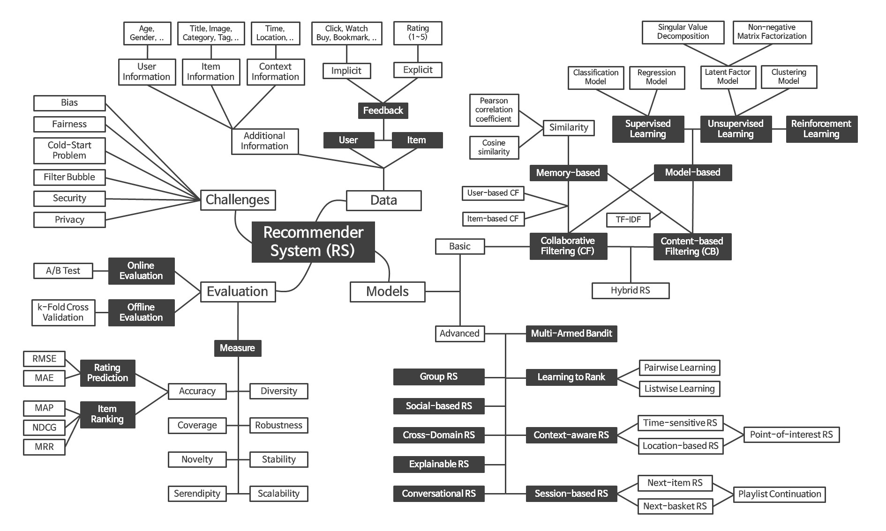
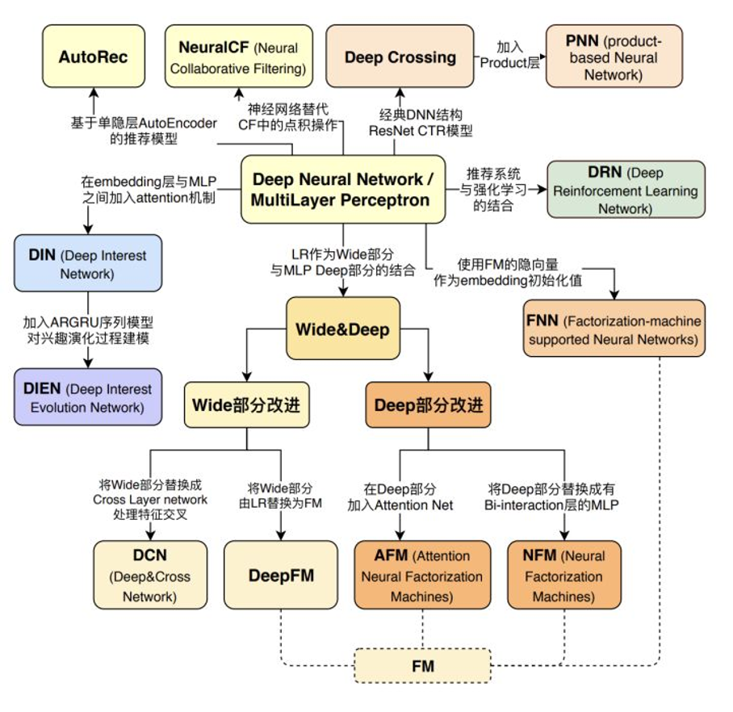

# 1. RecSys-Notes
记录推荐系统相关的优化经验、学习笔记。

- [1. RecSys-Notes](#1-recsys-notes)
- [2. 推荐系统适用场景](#2-推荐系统适用场景)
- [3. 推荐系统从0到1](#3-推荐系统从0到1)
  - [3.1. 冷启动](#31-冷启动)
    - [3.1.1. 系统冷启动](#311-系统冷启动)
    - [3.1.2. 新用户冷启动](#312-新用户冷启动)
    - [3.1.3. 新内容冷启动](#313-新内容冷启动)
  - [3.2. 搭建推荐系统](#32-搭建推荐系统)
    - [3.2.1. 数据采集](#321-数据采集)
    - [3.2.2. 数据处理](#322-数据处理)
    - [3.2.3. 推荐算法](#323-推荐算法)
    - [3.2.4. 评估体系](#324-评估体系)
- [4. 推荐系统优化](#4-推荐系统优化)
  - [4.1. 召回优化](#41-召回优化)
    - [4.1.1. 召回的评估](#411-召回的评估)
    - [4.1.2. 召回算法](#412-召回算法)
    - [4.1.3. 召回负样本处理](#413-召回负样本处理)
    - [4.1.4. 推荐历史去重](#414-推荐历史去重)
  - [4.2. 排序优化](#42-排序优化)
    - [4.2.1. 排序的评估](#421-排序的评估)
    - [4.2.2. 代理指标](#422-代理指标)
    - [4.2.3. 特征工程](#423-特征工程)
    - [4.2.4. 样本](#424-样本)
    - [4.2.5. 模型](#425-模型)
    - [4.2.6. 偏置处理](#426-偏置处理)
  - [4.3. 策略优化](#43-策略优化)
    - [4.3.1. 打造生态：消费者、生产者、平台三方利益兼顾](#431-打造生态消费者生产者平台三方利益兼顾)
    - [4.3.2. 流量扶持：新内容、新生产者、新品类](#432-流量扶持新内容新生产者新品类)
    - [4.3.3. 探索与利用](#433-探索与利用)
    - [4.3.4. 如何缓解头部效应](#434-如何缓解头部效应)
    - [4.3.5. 重排模型](#435-重排模型)
- [5. 推荐系统的未来](#5-推荐系统的未来)
  - [5.1. 对长期收益建模](#51-对长期收益建模)
  - [5.2. 对item组合建模](#52-对item组合建模)
  - [5.3. 极致的时效性](#53-极致的时效性)
  - [5.4. 更丰富的交互信息](#54-更丰富的交互信息)
  - [5.5. 与其他模块的协同](#55-与其他模块的协同)
  - [5.6. 自动化AutoML](#56-自动化automl)
- [6. 学习资源](#6-学习资源)

# 2. 推荐系统适用场景
信息过载+无明确意图

# 3. 推荐系统从0到1
在开始搭建推荐系统前，建议可以看看[Google的机器学习最佳实践(共43条)](https://developers.google.com/machine-learning/guides/rules-of-ml)[【汉】](https://www.jiqizhixin.com/articles/2018-05-22-12)。里面讲到进行机器学习的基本方法是：

1. 确保机器学习流程从头到尾都稳固可靠。
2. 从制定合理的目标开始。
3. 以简单的方式添加常识性特征。
4. 确保机器学习流程始终稳固可靠。
  
上述方法将在长时间内取得很好的效果。只要您仍然可以通过某种简单的技巧取得进展，就不应该偏离上述方法。增加复杂性会减缓未来版本的发布。

从0到1就是要解决冷启动问题，冷启动问题可以用产品的办法解决，也可以在推荐系统内解决。

## 3.1. 冷启动
### 3.1.1. 系统冷启动
### 3.1.2. 新用户冷启动
### 3.1.3. 新内容冷启动

## 3.2. 搭建推荐系统
一个完整的推荐系统包括：数据采集、数据处理、推荐算法、评估体系。下图把推荐系统的基本结构描述得非常清除了。

来源：[jihoo-kim/awesome-RecSys](https://github.com/jihoo-kim/awesome-RecSys)

### 3.2.1. 数据采集
数据采集包括了：用户信息采集(人群属性、兴趣问卷)，用户行为数据采集(埋点日志)，推荐日志，内容打标。

### 3.2.2. 数据处理
数据处理包括：样本生成、特征工程、报表

### 3.2.3. 推荐算法
经典推荐架构：召回、排序、策略。从0到1的过程中需要特别关注冷启动问题：系统冷启动、用户冷启动、内容冷启动。
- 召回。冷启动阶段没有太多用户行为数据。可以采集用户信息、多利用item标签、捕捉实时信息。热门召回、人群热门召回、用户采集兴趣召回、用户实时兴趣召回。另外需要做召回去重。
- 排序。冷启动阶段最好是用单目标简单模型，把整个流程跑通。
- 策略。黑白名单、调权、频控、打散、保量

有一些开源的推荐系统框架(2022-07-01更新star数)：
- [13.5k] [microsoft/recommenders](https://github.com/microsoft/recommenders)
- [6.2k] [shenweichen/DeepCTR](https://github.com/shenweichen/DeepCTR) 兼容tf1和tf2 
  - [2k] [shenweichen/DeepCTR-Torch(https://github.com/shenweichen/DeepCTR-Torch) pytorch版本
- [5.9k] [gorse-io/gorse](https://github.com/gorse-io/gorse) 用go实现的推荐系统
- [3.1k] [PaddlePaddle/PaddleRec](https://github.com/PaddlePaddle/PaddleRec) 百度开源，基于PaddlePaddle
- [1.3k] [tensorflow/recommenders](https://github.com/tensorflow/recommenders)
- [1k] [pytorch/torchrec](https://github.com/pytorch/torchrec) 
- [0.6k] [alibaba/EasyRec](https://github.com/alibaba/EasyRec) 兼容TF1.12-1.15 / TF2.x / PAI-TF

### 3.2.4. 评估体系
评估体系包括：在线评估（ABtest、报表）、离线评估。

# 4. 推荐系统优化

## 4.1. 召回优化

### 4.1.1. 召回的评估
召回率、准确率、hit率、内容覆盖度、基尼指数

### 4.1.2. 召回算法

- 热门召回
- 基于人群属性
- 协同过滤
  - [2013] [Amazon.com recommendations:Item-to-item collaborative filtering](https://www.cs.umd.edu/~samir/498/Amazon-Recommendations.pdf)  亚马逊提出经典的item-based协同过滤算法
- 基于向量
  - 无监督，类似word2vec
    - [2017] [Item2Vec-Neural Item Embedding for Collaborative Filtering](https://arxiv.org/pdf/1603.04259.pdf) 其实就是word2vec
    - [2018] [Real-time Personalization using Embeddings for Search Ranking at Airbnb](https://www.researchgate.net/publication/326503432_Real-time_Personalization_using_Embeddings_for_Search_Ranking_at_Airbnb)[【汉】](https://blog.csdn.net/da_kao_la/article/details/105798365) airbnb的房源来旭，基于word2vec，在样本的选择上有很多trick
  - 无监督 Graph Embedding
    - [2014] [DeepWalk: Online Learning of Social Representations](https://arxiv.org/pdf/1403.6652.pdf)][【汉】](https://zhuanlan.zhihu.com/p/45167021)  无权图+ random-walk + word2vec，学习网络结构，偏DFS
    - [2015] [LINE: Large-scale Information Network Embedding](https://arxiv.org/pdf/1503.03578.pdf)[【汉】](https://zhuanlan.zhihu.com/p/56478167) 二阶优化，Negative Sampling，alias负采样,偏BFS
    - [2016] [node2vec: Scalable Feature Learning for Networks](https://arxiv.org/pdf/1607.00653.pdf)[【汉】](https://zhuanlan.zhihu.com/p/56478167)，兼顾DFS和BFS
    - [2018] [Billion-scale Commodity Embedding for E-commerce Recommendation in Alibaba](https://arxiv.org/abs/1803.02349)[【汉】](http://felixzhao.cn/Articles/article/8) 引入side info，weight avg polling，
  - 有监督
    - [2013] [DSSM](https://www.microsoft.com/en-us/research/wp-content/uploads/2016/02/cikm2013_DSSM_fullversion.pdf)[【汉】](http://felixzhao.cn/Articles/article/4) 
      - 论文用的 sample softmax 4个负样本
      - 也可以用[triplet loss](https://zhuanlan.zhihu.com/p/136948465)  高内聚，低耦合
    - [2016] [DeepMatch:Deep Neural Networks for YouTube Recommendations](https://static.googleusercontent.com/media/research.google.com/zh-CN//pubs/archive/45530.pdf)[【汉】](http://felixzhao.cn/Articles/article/15)
      - 每个用户固定样本数量，避免高活用户带偏模型。加入样本年龄来消偏。ranking阶段用时长加权。
      - serving的时候用ANN库，如Faiss、HNSW 
    - [2018] [TDM: Learning Tree-based Deep Model for Recommender Systems](https://arxiv.org/pdf/1801.02294.pdf)[【汉】](https://blog.csdn.net/XindiOntheWay/article/details/85220342) 利用品类信息初始化数，学到向量之后用k-means聚类
    - [2019] [MOBIUS: Towards the Next Generation of Query-Ad Matching in Baidu’s Sponsored Search](http://research.baidu.com/Public/uploads/5d12eca098d40.pdf)[【汉】](https://zhuanlan.zhihu.com/p/144765227) 广告召回兼顾相关性和CTR等业务指标。人工构造低相关高ctr的样本做为负样本。
    - [2019] [Deep Semantic Matching for Amazon Product Search](https://wsdm2019-dapa.github.io/slides/05-YiweiSong.pdf) 购买、曝光未购买、随机三类样本，商品这边用n-gram引入商品title然后和商品其他属性特征一起过nn得到商品的向量。把oov的n-gram hash到指定数量的bin里面。
    - [2019] [SDM: Sequential Deep Matching Model for Online Large-scale Recommender System](https://arxiv.org/pdf/1909.00385.pdf)[【汉】](http://felixzhao.cn/Articles/article/11) 短期兴趣是一个session内的行为，最多50个，用lstm + multi-head self-attention + user attention, 长期兴趣是7天，各种序列，先过atten，然后concat到一起。最后又搞了一个gate来融合长短期特征。就一个疑问：召回模型这么搞能训得动吗？
    - [2019] [Multi-Interest Network with Dynamic Routing for Recommendation at Tmall](https://arxiv.org/abs/1904.08030)[【汉】](https://blog.csdn.net/whgyxy/article/details/123515246)
    - [2020] [Deep Retrieval: Learning A Retrievable Structure for Large-Scale Recommendations](https://arxiv.org/pdf/2007.07203.pdf)[【汉】](https://zhuanlan.zhihu.com/p/260453374)
    - [2020] [Embedding-based Retrieval in Facebook Search](https://arxiv.org/pdf/2006.11632.pdf)[【汉】](https://wulc.me/2020/08/30/%E3%80%8AEmbedding-based%20Retrieval%20in%20Facebook%20Search%E3%80%8B%E9%98%85%E8%AF%BB%E7%AC%94%E8%AE%B0/) 双塔模型，负样本选择，serv的处理，非常的工业风
    - [2020] [Controllable Multi-Interest Framework for Recommendation](https://arxiv.org/abs/2005.09347?context=cs.LG)[【汉】](https://zhuanlan.zhihu.com/p/267870721)
    - [2021] [Que2Search: Fast and Accurate Query and Document Understanding for Search at Facebook](https://research.facebook.com/publications/que2search-fast-and-accurate-query-and-document-understanding-for-search-at-facebook/)[【汉】](https://zhuanlan.zhihu.com/p/449725861)
    - [2021] [Embedding based Product Retrieval in Taobao Search](https://arxiv.org/pdf/2106.09297.pdf)[【汉】](https://zhuanlan.zhihu.com/p/410331760) 双塔，把用户侧搞得特别复杂，有query(query用n-gram,transormer等各种放方法处理)，有用户行为序列(实时、短期、长期)，有lstm，transformer、attention等来处理序列。
    - [2021] [Pre-trained Language Model for Web-scale Retrieval in Baidu Search](https://arxiv.org/pdf/2106.03373.pdf)[【汉】](https://blog.csdn.net/Kaiyuan_sjtu/article/details/119770178)

构建item向量索引：
- 向量索引的方法
  - 树，如KDtree
  - hash，如LSH
  - 聚类倒排，倒排里面有PCA降维，PQ降精度
  - 图算法,如NSW
- 开源向量索引库(2022-07-02更新star数)
  - [17.3k] [faiss](https://github.com/facebookresearch/faiss) 支持billion级别向量索引
    - [faiss原理（Product Quantization）](https://zhuanlan.zhihu.com/p/534004381)  IVFPQ，支持L2和内积
    - [Billion-scale similarity search with GPUs](https://arxiv.org/pdf/1702.08734.pdf)
  - [11.2k] [milvus](https://github.com/milvus-io/milvus) 已经是一个数据库了
    - [architecture_overview](https://milvus.io/docs/architecture_overview.md) 
    - [前所未有的 Milvus 源码架构解析](https://zhuanlan.zhihu.com/p/473617910)
  - [10k] [annoy](https://github.com/spotify/annoy) 支持 欧氏距离，曼哈顿距离，余弦距离，汉明距离或点(内)乘积距离
    - [一文带你了解Annoy！](https://zhuanlan.zhihu.com/p/109633593) 
  - [2k] [hnswlib](https://github.com/nmslib/hnswlib) 支持L2、内积、cos等距离方法
    - [Bithack/go-hnsw](https://github.com/Bithack/go-hnsw) 
    - [ANN召回算法之HNSW](https://zhuanlan.zhihu.com/p/379372268)
  - [1.4K] [vearch](https://github.com/vearch/vearch) 京东开源
  - [24k] [google-research/tree/master/scann](https://github.com/google-research/google-research/tree/master/scann)

参考: [几款多模态向量检索引擎：Faiss 、milvus、Proxima、vearch、Jina等](https://zhuanlan.zhihu.com/p/364923722)

### 4.1.3. 召回负样本处理

### 4.1.4. 推荐历史去重

## 4.2. 排序优化

### 4.2.1. 排序的评估
- 线上评估
  - ABtest。留存、时长、ctr、刷帖、点赞、评论、转发等
  - 模型评估指标。在线auc、gauc 
- 离线评估
  - 分类。auc、guac
  - 回归。rmse、mae、mape
- debug工具
  - 推荐线上服务debug
    - 在推荐的整个留存打印debug信息，然后把debug信息放到debug工具中展示。
  - 模型debug 
    - TensorBoard 

评估指标
- [MAP](https://zhuanlan.zhihu.com/p/274563041) (Mean Average Precision)  
- NDCG (Normalized Discounted Cumulative Gain)
  
### 4.2.2. 代理指标 
不同业务线的业务目标，用户关键行为都不一样，需要针对性的建模。另外构建一套样本是成本非常大的事情，包括推动前端增改卖点，大数据做好样本关联，数据校验，累计一段时间样本用于训练，整个周期会非常长。所以一般推荐在一开始就把所有能想到的user-item的行为数据都做好埋点。
- 电商
  - GMV。GMV=DAU*CTR*CVR*下单次数*单均价。以上指标一般是uv维度，按照天、周级别统计。无法作为直接排序label
  - item级别行为。曝光、击、加购、下单、成单、评分。电商的行为在时间维度上可能不较长，如成单、评分等动作的延迟甚至可能是几天。
- 娱乐
  - 用户总停留时长。TotalDur=DAU*刷帖数*贴均时长=(DNU+DAU*留存)*刷帖数*贴均时长。
  - item级别行为。
    - 隐式反馈：曝光、点击、时长、完播
    - 显式反馈：点赞、评论、转发
- 社交
  - 总互动。总互动=DAU*匹配率*互动数。
  - item级别行为。曝光、点击、关注、互动 

排序的迭代路径一般是由一轮排序，到包含粗排、精排的两轮排序。甚至随着候选池的增加，可以增加更多轮排序。由单一目标排序，到多目标融合排序。由简单模型到复杂模型。LR、FM、Wide&Deep、DIN、MMOE、SNR

引入多目标的几种方式：
- 样本调权
  - 见：[街首页推荐多目标优化之reweight实践：一把双刃剑？](https://zhuanlan.zhihu.com/p/271858727)
- 线性加权。Score = a*scoreA + b * scoreB + c * ScoreC + … + m * ScoreM
- 乘法加权。一般用在电商场景 Score = pow(ctr+ai, bi) * pow(price+aj, bj)
  
业界的一些多目标融合的实践：
- [BIGO | 内容流多目标排序优化](https://toutiao.io/posts/ds6kdac/preview)
- [爱奇艺：多目标排序在爱奇艺短视频推荐中的应用](https://juejin.cn/post/6977633076390133796)
- [快手：多目标排序在快手短视频推荐中的实践](http://www.360doc.com/content/21/0225/09/7673502_963854442.shtml)

### 4.2.3. 特征工程
- 主体维度
  - 用户
    - 人群属性
    - 行为特征
    - 统计特征
  - item
    - 标签
    - 统计特征
  - context
    - 地理位置
    - 时间
    - 推荐tab
- 时效性维度
- 批量特征
- 实时特征

特征的计算框架
- 批量 
  - Hive
  - Spark 
    -  [sparkInternals](https://github.com/JerryLead/SparkInternals/tree/master/markdown) github上的一个讲spark原理的项目，强烈推荐
    -  [Spark Overview](http://spark.apache.org/docs/latest/) spark官方文档，太多了，偶尔看看
    -  [Spark的使用及源码走读](http://www.cnblogs.com/hseagle/category/569175.html) 牛人的spark笔记，mark，还没看
    -  [Tuning Spark](https://spark.apache.org/docs/latest/tuning.html)
- 实时 
  - Storm
  - Flink 

内容理解。通过NLP和CV的能力，给视频、图片的自动打标。做好场景识别、人脸识别、OCR、文本的关键词提取等。
NLP相关：
- Glove [NLP模型笔记】GloVe模型简介](https://blog.csdn.net/edogawachia/article/details/105804378) 相比起绝对地描述一个词语，通过与第三者的比较，得到第三者与两个词语中的哪个更接近这样一个相对的关系，来表达词语的含义，实际上更符合我们对于语言的认知。这样学习出来的vector space具有一个meaningful substructure。
- [dav-word2vec](https://github.com/dav/word2vec) [【汉】](https://www.jianshu.com/p/471d9bfbd72f) google的word2vec
- [2016] [Bag of Tricks for Efficient Text Classification](https://arxiv.org/pdf/1607.01759.pdf)[【汉】](https://blog.51cto.com/u_13933750/3229465)  facebook开源的FastText，char-level n-gram,
- [2017] [Attention Is All You Need](https://arxiv.org/abs/1706.03762) Transformer
- [2018] [BERT(Bidirectional Encoder Representations from Transformers)](https://github.com/google-research/bert/) 上下文相关的表达，采用底层的双向编码，预训练与调优
    - [【NLP】彻底搞懂BERT](https://www.cnblogs.com/rucwxb/p/10277217.html) 
    - [BERT: Pre-training of Deep Bidirectional Transformers for Language Understanding](https://arxiv.org/abs/1810.04805)
    - [BERT代码解读(3)-输出](https://www.jianshu.com/p/683b133310a6)
    
CV相关
- [PaddleVideo](https://github.com/PaddlePaddle/PaddleVideo)

### 4.2.4. 样本
样本=label+特征。
label一般来自客户端的埋点，也有用到服务端数据的(比如，点赞、成单等数据服务端也有记录)。一般都会有多个label日志(曝光、点击、时长、点赞等)，需要把这些日志关联起来。特征来源于推荐埋点日志或离线批处理特征，最好是把特征都埋在推荐replay日志中，这样可以避免离线在线特征不一致问题。label埋点和推荐replay日志的关联可以通过约定的唯一性id来确定，如：user_id、item_id对，或者唯一性的session_id。

label埋点日志关联，可以在客户端关联，也可以在大数据这里关联。为了减少客户端的复杂性，现在一般都是无代码埋点，只埋事件日志，然后由大数据这边关联。中间存在一些问题：
- 日志丢失
  - 客户端要做日志的持久化, 会导致日志延迟比较大，不过总比丢了好
  - 日志回传要做好丢包重传等机制
  - 服务端接收后一般是直接到kafka
- user-itme粒度的日志回传事件跨度大
  - 天级别批处理，要做好跨天的处理 
  - 实时关联，一般设定cache时间窗口
    - 负样本cache,[skip-above](https://tech.meituan.com/2016/04/21/online-learning.html)
    - [负样本不cache](https://www.infoq.cn/article/lTHcDaZelZgC639P1P5q)，会有False Negative问题
      - 样本重要性采样(importance sampling)
      - FN矫正
      - PU loss (Positive-unlabeled loss) 问题是来多个正样本怎么办
      - 延迟反馈 Loss

### 4.2.5. 模型
正则：L1、L2、Dropout、BatchNorm、Relu
序列建模：Attention、Transformer、GRU、LSTM
参数共享：gate、routing
优化器：FTRL、Adagrad、Adam

树模型：
- GBDT
  - [GBDT（MART） 迭代决策树入门教程 | 简介](http://blog.csdn.net/w28971023/article/details/8240756)
  - [GBDT：梯度提升决策树](http://www.jianshu.com/p/005a4e6ac775) 看过之后对gbdt原理有了大概了解，感觉还需要去了解决策树、adaboost、random forest、xgboost 这些东西。
  - [机器学习算法总结--GBDT](http://blog.csdn.net/lc013/article/details/56667157) 
- [Xgboost](https://github.com/dmlc/xgboost)
  - [Introduction to Boosted Trees](https://xgboost.readthedocs.io/en/stable/tutorials/model.html) 1.5h xgboost官网上对BT介绍文章，这个文章降低非常浅显易懂，首先摆出训练时的优化函数=偏差+复杂度，我们要在减少偏差和减少复杂度之间寻求平衡，先讲了CART的结构，然后讲BT是一步步添加树的，然后讲到每次添加一棵树的时候，是如何从众多树里面寻找到最好的那颗树，这里面就是刚刚说的优化函数。最后在讲了单颗的训练过程中也可以尽量去优化。感觉大致懂了，有时间再去深究里面的一些东西吧。  论文 [XGBoost: A Scalable Tree Boosting System](http://www.kdd.org/kdd2016/papers/files/rfp0697-chenAemb.pdf) 
  - [xgboost 实战以及源代码分析](http://m.blog.csdn.net/u010159842/article/details/77503930)
  - [xgboost_code_analysis](https://github.com/daoliker/xgboost_code_analysis)
  - [XGboost核心源码阅读](http://mlnote.com/2016/10/29/xgboost-code-review-with-paper/)
  - [DART booster](http://xgboost.apachecn.org/cn/latest/tutorials/dart.html) 在gbtree.cc中看到dart，特性就是通过drop树来解决over-fitting。但是预测会变慢，early-stop可能不稳定。
    - [Dropout 解决 overfitting](https://www.jianshu.com/p/b5e93fa01385)  简单搜了下，在NN中就是drop一些单元，属于一种正则化的手段。
  - [Monotonic Constraints](https://xgboost.readthedocs.io/en/latest/tutorials/monotonic.html) 在模型训练中添加单调性约束
  - 模型调参
    - [xgboost参数](http://xgboost.readthedocs.io/en/latest/parameter.html)([汉](http://blog.sina.com.cn/s/blog_9132d85b0102w65l.html)) 这些参数不太懂：gamma 、 max_delta_step、colsample_bylevel、alpha、lambda、 b。 
    个人理解所有的GB，学出来的都是tree，本质上就是用特征将目标进行分类。一颗树学习得太浅，所以会学出很多颗tree，然后加权到一起，这样可以学得更精细一点，可以对一个特征进行更多次切分，可以试验多种特征组合。 
    然后由于用于训练的样本是有限的，训练样本级与实际总样本之间可能存在偏差，而我们学到的森林其实是对我们的样本集的统计学特性的模拟，和样本拟合得太匹配，就越容易拟合到其中的偏差部分。所以会通过控制树的深度、叶子节点的样本最小数量等控制精度，以免学得太过了。 
    由于样本收集的时候可能存在一些不随机的部分，就是有偏差。我们在样本集的基础上，做一些处理，来消除这个不随机的部分。一种是随机的抽一部分样本（随机样本子集），一种是训练的时候只训练一部分特征（随机特征子集）。 
    还有一种就是我们学习的时候，不要学得太像这个样本了，就是所谓的学习率调低一点，学习得更模糊一点。 
    另一方面因为是GB，就是梯队推进，就是走一段路看一下调整方向，然后继续继续往前走一步。这个过程中，如果每次走的路短一点，就是增加了对齐方向的次数，就越不容易出现偏差，就不容易过拟合。 
    如果样本集的正负样本数量差距太大，可能导致正样本被埋没了，所以有必要增加正样本的权重。
    - [param_tuning](https://xgboost.readthedocs.io/en/latest/tutorials/param_tuning.html) 理解样本偏差，控制过拟合，处理不平衡的数据集。  
    - [论XGBOOST科学调参](https://zhuanlan.zhihu.com/p/25308120)
    - [为什么xgboost/gbdt在调参时为什么树的深度很少就能达到很高的精度？](https://www.zhihu.com/question/45487317)
    - [机器学习算法中GBDT和XGBOOST的区别有哪些？](https://www.zhihu.com/question/41354392)
    - [xgboost如何使用MAE或MAPE作为目标函数?](https://zhuanlan.zhihu.com/p/34373008)
    - [Xgboost-How to use “mae” as objective function?](https://stackoverflow.com/questions/45006341/xgboost-how-to-use-mae-as-objective-function)
  - 模型分析
    - [xgbfi](https://github.com/limexp/xgbfir)  xgboost特征交互和重要度。里面提到用Gain（特征增益）和Cover（分裂方向的概率）构造出期望增益ExpectedGain，相比于分裂次数更能体现特征的实际作用。另外考虑了如何评估多个特征之间的影响，就是计算一条路径的增益。不过工具还不完善，对评估指标本身也没有进行详细解释。
    - [Understand your dataset with XGBoost](http://xgboost.readthedocs.io/en/latest/R-package/discoverYourData.html) xgboost提供了特征重要度工具，主要有gain和cover
- [LightGBM](https://github.com/Microsoft/LightGBM)
  - [如何看待微软新开源的LightGBM?](https://www.zhihu.com/question/51644470/answer/130946285)
  - [LightGBM 的中文文档](http://lightgbm.apachecn.org/cn/latest/index.html)

来源：[从算法到工程，推荐系统全面总结](https://www.infoq.cn/article/qeawCIJQfrycQpueaqs4)

从LR到DNN模型：
- [2007] [Predicting clicks: estimating the click-through rate for new ads](https://www.microsoft.com/en-us/research/wp-content/uploads/2016/02/predictingclicks.pdf) LR算法应用于CTR问题
- [2010] [Factorization Machines](https://www.csie.ntu.edu.tw/~b97053/paper/Rendle2010FM.pdf) FM算法
- [2011] [Fast Context-aware Recommendations with Factorization Machines](https://www.ismll.uni-hildesheim.de/pub/pdfs/Rendle_et_al2011-Context_Aware.pdf) 
- [2013] [Ad Click Prediction: a View from the Trenches](https://static.googleusercontent.com/media/research.google.com/zh-CN//pubs/archive/41159.pdf) 提出了FTRL算法
- [2014] [Practical lessons from predicting clicks on ads at facebook](https://quinonero.net/Publications/predicting-clicks-facebook.pdf) LR+GBDT组合模型
- [2016] [Deep Neural Networks for YouTube Recommendations](https://static.googleusercontent.com/media/research.google.com/zh-CN//pubs/archive/45530.pdf) 排序这里用时长作为正样本权重，然后预估近似时长
- [2016] [Wide & Deep Learning for Recommender Systems](https://arxiv.org/abs/1606.07792)[【汉】](http://felixzhao.cn/Articles/article/18) wide记忆，deep稠密特征交叉
- 特征交叉
  - [2016] [Deep Crossing: Web-Scale Modeling without Manually Crafted Combinatorial Features](https://www.kdd.org/kdd2016/papers/files/adf0975-shanA.pdf)[【汉】](https://zhuanlan.zhihu.com/p/91057914) 没用过。感觉跟其他DNN模型差不多，可能跟DSSM比，emb喂给MLP更早，所以叫corss吧。
  - [2016] [Product-based Neural Networks for User Response Prediction](https://arxiv.org/abs/1611.00144)[【汉】](https://blog.csdn.net/XindiOntheWay/article/details/105618692) emb先做两两交叉，然后再喂给MLP。
  - [2017] [DeepFM : A Factorization-Machine based Neural Network for CTR Prediction](https://arxiv.org/abs/1703.04247)[【汉】](http://felixzhao.cn/Articles/article/26)DeepFM在Wide&Deep的基础上引入了交叉特征，使得模型能够更好的学习到组合特征，wide是一阶，FM是二阶交叉，MLP是高阶交叉。
  - [2017] [Deep & Cross Network for Ad Click Predictions](https://arxiv.org/abs/1708.05123)[【汉】](http://felixzhao.cn/Articles/article/25) 对Wide & Deep模型优化，将Wide & Deep模型中的Wide部分替换成Cross network，用于自动化特征交叉。试过，参数量有点大。
  - [2017] [Attentional Factorization Machines: Learning the Weight of Feature Interactions via Attention Networks](https://arxiv.org/abs/1708.04617)[【汉】](https://blog.csdn.net/buwei0239/article/details/86766008) AFM对FM不同的特征交互引入不同重要性来改善FM，重要性通过注意力机制来学习；
  - [2018] [xDeepFM: Combining Explicit and Implicit Feature Interactions for Recommender Systems](https://arxiv.org/abs/1803.05170)[【汉】](https://blog.csdn.net/qq_40006058/article/details/88870482) 在DCN基础上，用CIN代替cross网络，每个vector一个参数，而不是每个bit一个参数。
  - [2019] [Feature Generation by Convolutional Neural Network for Click-Through Rate Prediction](https://arxiv.org/pdf/1904.04447.pdf)[【汉】](https://blog.csdn.net/w55100/article/details/90601310) 底层用卷积在做特征的局部交叉
  - [2019] [Interaction-aware Factorization Machines for Recommender Systems](https://arxiv.org/pdf/1902.09757.pdf) 有点像AFM，在FM基础上魔改。 
  - [2019] [FiBiNET: Combining Feature Importance and Bilinear feature Interaction for Click-Through Rate Prediction](https://arxiv.org/pdf/1905.09433.pdf) [【汉】](https://zhuanlan.zhihu.com/p/72931811)通常处理特征交叉是通过Hadamard product和inner product，很少关注交叉特征的重要性，在FiBiNET中，改进特征的交叉方式以及增加特征重要行的学习，分别通过**SENET**机制动态学习特征的重要性，通过**bilinear**函数学习特征的交叉
  - [2019] [AutoInt: Automatic Feature Interaction Learning via Self-Attentive Neural Networks](https://arxiv.org/pdf/1810.11921.pdf)[【汉】](https://blog.csdn.net/pearl8899/article/details/106747210) 用multi-head self attention来学习emb的交叉
- 序列特征建模
  - [2016] [Session-based Recommendations with Recurrent Neural Networks](https://arxiv.org/pdf/1511.06939.pdf)[【汉】](https://zhuanlan.zhihu.com/p/28776432) 用GRU来对用户session序列建模，不过很少这么建模。因为还要考虑跟其他特征怎么组合进来的问题。
  - [2018] [Deep Interest Network for Click-Through Rate Prediction](https://arxiv.org/abs/1706.06978)[【汉】](https://zhuanlan.zhihu.com/p/54085498) DIN其实就是序列emb加权求和
  - [2019] [Behavior Sequence Transformer for E-commerce Recommendation in Alibaba](https://arxiv.org/abs/1905.06874v1)[【汉】](https://zhuanlan.zhihu.com/p/96338316) item序列过tranformer，多层tranformer后auc反而降低
  - [2019] [Deep Interest Evolution Network for Click-Through Rate Prediction](https://arxiv.org/abs/1809.03672) DIEN，用GRU来建模用户兴趣迁移
  - [2019] [Deep Session Interest Network for Click-Through Rate Prediction](https://arxiv.org/pdf/1905.06482.pdf)[【汉】](https://zhuanlan.zhihu.com/p/71695849)
  - [2019] [BERT4Rec: Sequential Recommendation with Bidirectional Encoder Representations from Transformer](https://arxiv.org/pdf/1904.06690.pdf)[【汉】](https://blog.csdn.net/pearl8899/article/details/118003945) 直接用bert来建模用户序列特征
- [2017] [Learning Piece-wise Linear Models from Large Scale Data for Ad Click Prediction](https://arxiv.org/pdf/1704.05194.pdf)[【汉】](https://zhuanlan.zhihu.com/p/392793309) 阿里的MLR模型，把样本聚成多簇，然后分别用LR去分类。
- [2019] [Real-time Attention Based Look-alike Model for Recommender System](https://arxiv.org/abs/1906.05022) 实时Look-alike 算法在微信看一看中的应用
- [2019] [Deep Learning Recommendation Model for Personalization and Recommendation Systems](https://arxiv.org/abs/1906.00091v1) facebook的DLRM，比较工业风
- [2020] [FuxiCTR: An Open Benchmark for Click-Through Rate Prediction](https://arxiv.org/abs/2009.05794) [【汉】](https://blog.csdn.net/Eric_1993/article/details/109038340)对多种CTR模型的对比，包括浅层模型和深度模型，浅层模型包括LR，FM，FFM等，深度模型包括DNN，Wide&Deep，PNN等
- [2020] [COLD: Towards the Next Generation of Pre-Ranking System](https://arxiv.org/abs/2007.16122v1)[【汉】](https://cloud.tencent.com/developer/article/1677703) 长期以来，粗排（pre-ranking）一直被认为是精排（ranking）的简化版本，这就导致系统会陷入局部最优，文中提出COLD同时优化粗排模型和计算效率

模型引入图像特征：
- [2017] [Visual Search at eBay](https://arxiv.org/pdf/1706.03154.pdf)
- [2017] [Visual Search at Pinterest](https://arxiv.org/pdf/1706.03154.pdf)
- [2021] [Visual Search at Alibaba](https://arxiv.org/pdf/2102.04674.pdf)

推荐的可解释性：
- [2018] [Explainable Recommendation via Multi-Task Learning in Opinionated Text Data](https://arxiv.org/pdf/1806.03568.pdf)[【汉】](https://blog.csdn.net/TgqDT3gGaMdkHasLZv/article/details/84576762) 个性化推荐的可解释性，需要依赖用户对商品的评论信息进行训练。
- [2018] [TEM: Tree-enhanced Embedding Model for Explainable Recommendation](http://staff.ustc.edu.cn/~hexn/papers/www18-tem.pdf)[【汉】](https://blog.csdn.net/qq_35771020/article/details/88722399)
- [2018] [Neural Attentional Rating Regression with Review-level Explanations](http://www.thuir.cn/group/~YQLiu/publications/WWW2018_CC.pdf)[【汉】](https://blog.csdn.net/weixin_41306220/article/details/103232795)

多任务模型结构：  
- [2018] [ESMM](https://zhuanlan.zhihu.com/p/57481330)[【code】](https://github.com/busesese/ESMM)
- [2018] [MMOE](https://dl.acm.org/doi/pdf/10.1145/3219819.3220007)
- [2019] [MKR](https://arxiv.org/pdf/1901.08907.pdf)[【code】](https://github.com/hwwang55/MKR)[【汉】](https://blog.csdn.net/qq_40006058/article/details/89977929)
- [2019] [Recommending What Video to Watch Next: A Multitask Ranking System](https://daiwk.github.io/assets/youtube-multitask.pdf)[【汉】](https://zhuanlan.zhihu.com/p/82584437)
- [2019] [SNR:Sub-Network Routing for Flexible Parameter Sharing in Multi-Task Learning](https://ojs.aaai.org//index.php/AAAI/article/view/3788)
- [2019] [A Pareto-Efficient Algorithm for Multiple Objective Optimization in E-Commerce Recommendation](http://ofey.me/papers/Pareto.pdf)
- [2019] [Recommending What Video to Watch Next: A Multitask Ranking System](https://dl.acm.org/doi/10.1145/3298689.3346997) 多目标优化是推荐系统中一个重要的研究方向，文章为解决多目标提出Multi-gate Mixture-of-Experts，以及为解决选择偏差的问题，提出对应的解决方案
- [2020] [Progressive Layered Extraction (PLE): A Novel Multi-Task Learning (MTL) Model for Personalized Recommendations](https://dl.acm.org/doi/10.1145/3383313.3412236)[【汉】](https://zhuanlan.zhihu.com/p/272708728) 腾讯的PLE，就是有私有expert和公共expert

多任务模型的loss设计：
- [多个label的loss如何平衡](https://blog.csdn.net/qq_34527082/article/details/100048864)  [【知乎上的讨论】](https://www.zhihu.com/question/359962155)
  - [2017] [GradNorm: Gradient Normalization for Adaptive Loss Balancing in Deep Multitask Networks](https://arxiv.org/abs/1711.02257) 对更新快的任务，使用小一点的学习率，对更新慢的任务，使用大一点的学习率。
  - [2018] [Multi-Task Learning Using Uncertainty to Weigh Losses for Scene Geometry and Semantics](https://arxiv.org/abs/1705.07115) [【code】](https://github.com/ranandalon/mtl) 基于不确定性，最终效果比我人工调参的结果好一丢丢
  - [2019] [Multi-Task Learning as Multi-Objective Optimization](https://arxiv.org/pdf/1810.04650.pdf)

业界实践 
- [多目标排序各大公司落地](https://zhuanlan.zhihu.com/p/341345727)

### 4.2.6. 偏置处理
偏置的类型：
- 点击位置偏置
- 视频时长偏置

处理偏置的方法：
- 模型训练学习bias，serv的时候去掉bias
  - 如: [Youtube推荐算法中的多任务模型和消偏](https://zhuanlan.zhihu.com/p/261170030)

## 4.3. 策略优化

### 4.3.1. 打造生态：消费者、生产者、平台三方利益兼顾

### 4.3.2. 流量扶持：新内容、新生产者、新品类

### 4.3.3. 探索与利用
缓解回音壁、保持多样性、提供惊喜和新鲜感

### 4.3.4. 如何缓解头部效应

### 4.3.5. 重排模型

- [2019] [Personalized Re-ranking for Recommendation](https://arxiv.org/pdf/1904.06813.pdf)[【汉】](https://zhuanlan.zhihu.com/p/79182904) rerank的10个item是一个序列，用transformer来重排
- [微信「看一看」 推荐排序技术揭秘](http://blog.itpub.net/31559354/viewspace-2704029/) 重排用到了DQN
  

# 5. 推荐系统的未来

## 5.1. 对长期收益建模
强化学习在推荐的应用：
- [2018] [Top-K Off-Policy Correction for a REINFORCE Recommender System](https://arxiv.org/abs/1812.02353)[【汉】](https://zhuanlan.zhihu.com/p/71601897) 据说获得了Youtube近两年单次上线的最高收益，看起来是召回阶段，召回的优化效果都这么牛逼！
  - [Intro to Policy Optimization](https://spinningup.openai.com/en/latest/spinningup/rl_intro3.html)
  - [2015] [Trust Region Policy Optimization](https://arxiv.org/abs/1502.05477)
- [2019] [Reinforcement Learning for Slate-based Recommender Systems: A Tractable Decomposition and Practical Methodology](https://arxiv.org/abs/1905.12767)[【汉】](https://zhuanlan.zhihu.com/p/83387560) 这个是用来排序的ctr*Q值
  - [sarsa 算法](https://mofanpy.com/tutorials/machine-learning/reinforcement-learning/intro-sarsa/) 
- [Values of User Exploration in Recommender Systems](https://dl.acm.org/doi/pdf/10.1145/3460231.3474236) 评估探索对长期收益的影响。对比了两种探索的做法：Entropy Regularization 和 Intrinsic Motivation(其实就是对没见过的item加一个提权)。多样性和新颖性并不一定带来用户体验上升，并且过犹不及。惊喜度才是长期收益的关键。
  
强化学习的资料：
- [openai的强化学习课程](https://spinningup.openai.com/en/latest/)
- [Facebook-朱哲清Bill 关于RL的研究进展的描述](https://www.zhihu.com/question/404471029/answer/2485186947)

## 5.2. 对item组合建模

## 5.3. 极致的时效性
实时特征、实时模型、端上重排
- 实时特征。这个最容易，时效性可以比模型高。
- 实时模型
  - [半实时](https://zhuanlan.zhihu.com/p/75597761)
    - GBDT+LR
    - Wide&Deep 
  - 全实时。现在都有ps了，模型本身是可以实时训练的。这里有几个问题
    - 模型的batch大小。为了凑齐batch最长等多久。
    - 更新serving模型的实践间隔。一个是工程问题，大模型参数同步也要实践。另外一个是更新太快不一定有效果。对广告这种特别依赖id，且素材id更新非常频繁的，可能会比较有用。
- 端上重排
  - 阿里 [EdgeRec：边缘计算在推荐系统中的应用](https://mp.weixin.qq.com/s/O806chMT_BFzkA-Tuv94Hw) 
  - 快手 [渠江涛：重排序在快手短视频推荐系统中的演进](https://mp.weixin.qq.com/s/OTyEbPCBh1NHogPM7bBtvA)

实时优化器。本质上就是要加好正则，避免被少数样本带偏了
  - FTRL(Follow The Regularized Leader)
    - [Online Learning算法理论与实践](https://tech.meituan.com/online_learning.html) 主要介绍Online Learning的基本原理和两种常用的Online Learning算法：FTRL（Follow The Regularized Leader）和BPR（Bayesian Probit Regression）。基本原理理解，具体公式推导有点晕。
    - [RDA， FTRL 在线学习算法最初的优化公式是依据什么得到的？](https://www.zhihu.com/question/266462198/answer/309780073)
    - [在线学习（Online Learning）导读](https://zhuanlan.zhihu.com/p/36410780)
    - [Online Learning and Online Convex Optimization](http://www.cs.huji.ac.il/~shais/papers/OLsurvey.pdf) 其中的2.3节讲到FTRL
  - MIRA(Margin-infused relaxed algorithm)
    - [浅谈在线机器学习算法](http://yjliu.net/blog/2012/07/14/a-brief-talk-about-online-learning.html) 提到了Perceptron算法用于二分类问题，MIRA算法用于多类问题。
  - Online gradient descent: Logarithmic Regret Algorithms for Online Convex Optimization
  - Dual averaging: Dual Averaging Methods for Regularized Stochastic Learning and Online Optimization
  - Adagrad: Adaptive Subgradient Methods for Online Learning and Stochastic Optimization
  - PA(Online Passive-Aggressive Algorithms)
    - [Online Passive-Aggressive Algorithms](https://link.zhihu.com/?target=http%3A//www.jmlr.org/papers/volume7/crammer06a/crammer06a.pdf)  Shai Shalev-Shwartz于[2006]发表，提出了一种基于边界的在线学习算法簇，可以支持多种预测任务。具体来说可以用于二分类、回归、多分类、序列预测等任务，使用hingeloss损失函数。
    - [Online Learning：Theory, Algorithms, and Applications](http://ttic.uchicago.edu/~shai/papers/ShalevThesis07.pdf) Shai Shalev-Shwartz的博士论文，[2007]发表，旨在建立一个支持多种预测任务的在线学习簇。
  - 综述性文章
    - [Online Learning and Stochastic Approximations](http://leon.bottou.org/publications/pdf/online-1998.pdf) L´eon Bottou，AT&T实验室，[2018]修订版，在线学习和随机优化的解释文章。
    - [Online Learning and Online Convex Optimization](http://www.cs.huji.ac.il/~shais/papers/OLsurvey.pdf) Shai Shalev-Shwartz于[2011]写的一篇综述性论文

## 5.4. 更丰富的交互信息

## 5.5. 与其他模块的协同
迁移学习。引入其他人口(如搜索)，其他app的用户信息。

## 5.6. 自动化AutoML

AutoML工具(2022-07-07更新star数):
- 资料
  - [windmaple/awesome-AutoML](https://github.com/windmaple/awesome-AutoML)
    - [AutoML: Methods, Systems, Challenges (first book on AutoML)](https://www.automl.org/book/) automl的书
      -  HPO 超参搜索
         -  mode-free, 网格搜索，随机搜索，guide search 固定一个参数找到最优质然后训练下一个，进化算法(遗传算法、进化算法、粒子群优化)
         -  bayesian优化，多保真度优化(就是先用少量子集去筛选各种参数，然后逐渐增加样本量)
      -  meta-learning，元数据，用元数据学习参数空间特点如：参数重要性、参数间的相关性，任务之间的相似性。
      -  NAS  neural architecture search，神经架构搜索。
  - [AutoML的一些开源项目](https://zhuanlan.zhihu.com/p/93109455)
- 超参搜索
  - [21.2k] [ray-project/ray](https://github.com/ray-project/ray) 其中Tune是超参学习，RLlib是强化学习学习。
    - [Ray Tune](https://zhuanlan.zhihu.com/p/364613087)
  - [6.3k] [hyperopt/hyperopt](https://github.com/hyperopt/hyperopt)
- 自动特征
  - [6.5k] [blue-yonder/tsfresh](https://github.com/blue-yonder/tsfresh)  从时间序列自动提取特征
  - [6.3k] [alteryx/featuretools](https://github.com/alteryx/featuretools) 自动特征工程开源库
  - [2k] [scikit-learn-contrib/category_encoders](https://github.com/scikit-learn-contrib/category_encoders) 分类特征编码
- automl框架
  - [8.6k] [keras-team/autokeras](https://github.com/keras-team/autokeras)
  - [8.6k] [EpistasisLab/tpot](https://github.com/EpistasisLab/tpot)
  - [5.9k] [h2oai/h2o-3](https://github.com/h2oai/h2o-3)

# 6. 学习资源

- [zhaozhiyong19890102/Recommender-System](https://github.com/zhaozhiyong19890102/Recommender-System)
- [shenweichen/AlgoNotes](https://github.com/shenweichen/AlgoNotes)
- [jihoo-kim/awesome-RecSys](https://github.com/jihoo-kim/awesome-RecSys)
- [fun-rec](https://github.com/datawhalechina/fun-rec) 推荐系统入门教程